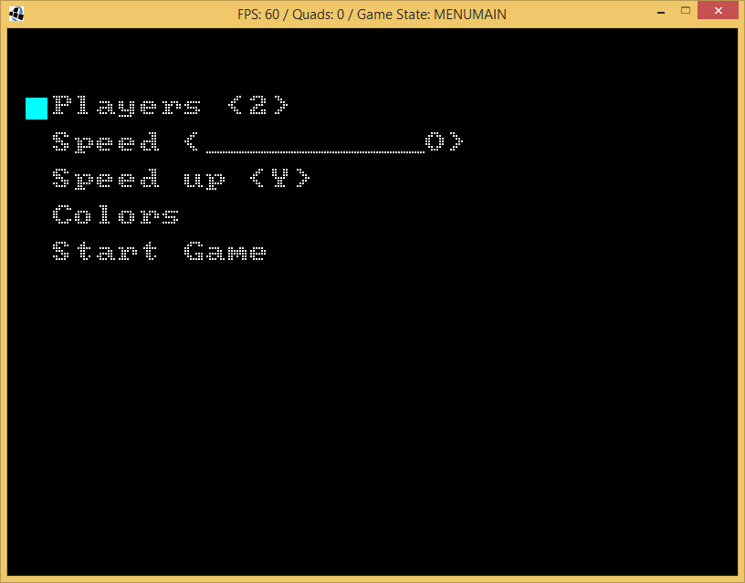
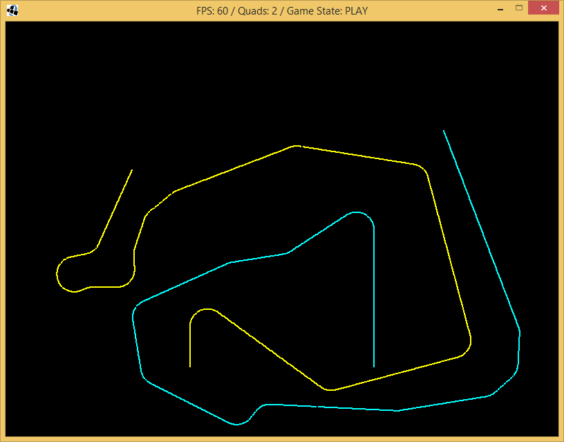
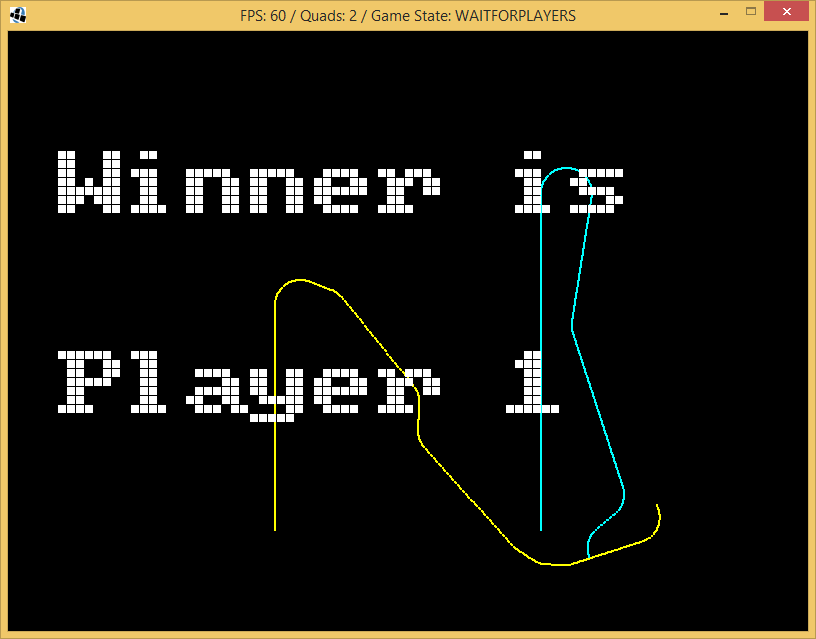

# cervi
Cervi (Worms) is Java remake of old DOS game Cerv I

## maturity
This game is in pre-alpha stage and many things does not work. You have been warned. 

## gameplay
All the players control their worms on the same screen. From the very beginning, each worm is increased in length with same speed in certain direction. Player should not collide with other worm bending its increase to the left or to the right.

## history
This game was created during Java4Beginners traning to improve my Java skill.

## license
GPLv3

## libraries needed
You should have lwjgl instaled to compile this game - https://www.lwjgl.org/

## screenshots

